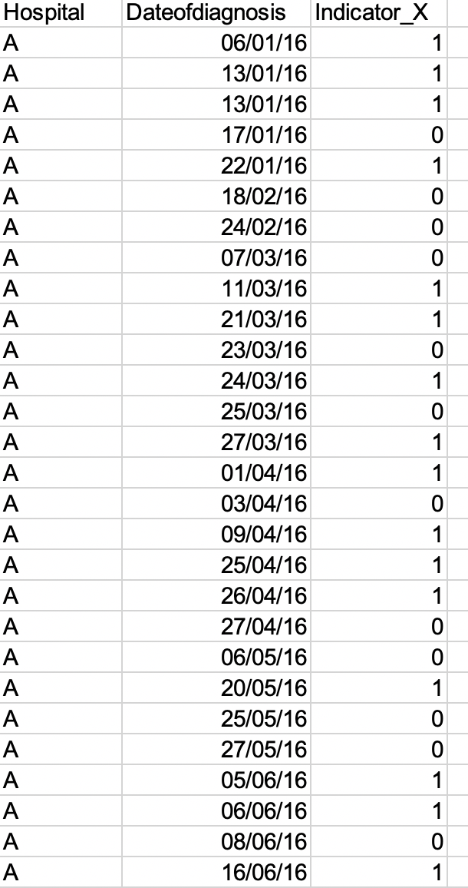
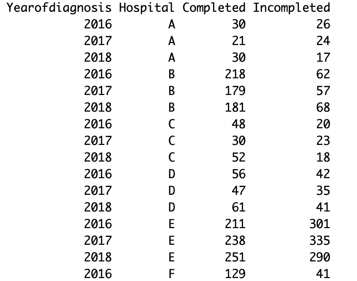

# Hospitals-Performance-Dashboard

## Link to dashboard: https://bit.ly/hospital_dashborad

This dashboard made using R shiny shows the performance of 'Hospital A' and how it compares to other hospitals. The data is pretty straight forward, it has the following three columns:
* Hospital: Name of the hospital
* Date
* Indicator: This column contains '0' and '1's for each row showing whether an assessment was done in a hospital on a specific date.

Hence, for the scope of this task, the comparison between hospitals is done on the basis of just one attribute i.e assesment completion. A snippet of data is shown below.

Minor transformartions are performed on the data before visualising it in the dashboard:

* Creating seperate day, month and year column.

* Reshaping the data to get the count of completed and incompleted assesmments.

With such minor changes, the data was ready to be visualized in the dashboard.

