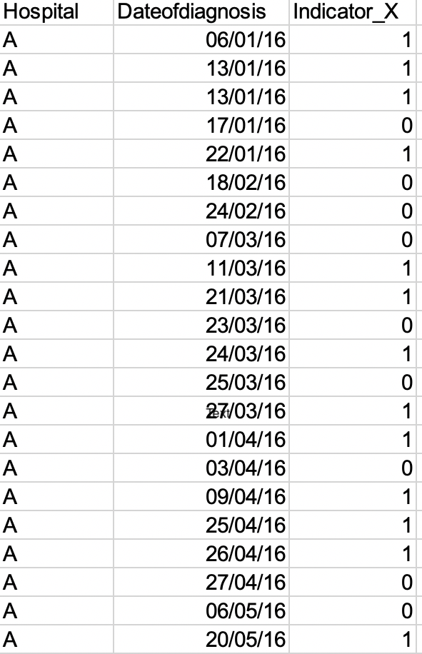

# Hospitals-Performance-Dashboard

This dashboard made using R shiny shows the performance of 'Hospital A' and how it compares to other hospitals. The data is pretty straight forward, it has an Indicator for each hospital for several dates, as shown below:

Minor transformartions are performed on the data before visualising it in the dashboard:

* Creating seperate day, month and year column.

https://bit.ly/hospital_performance_dashboard
